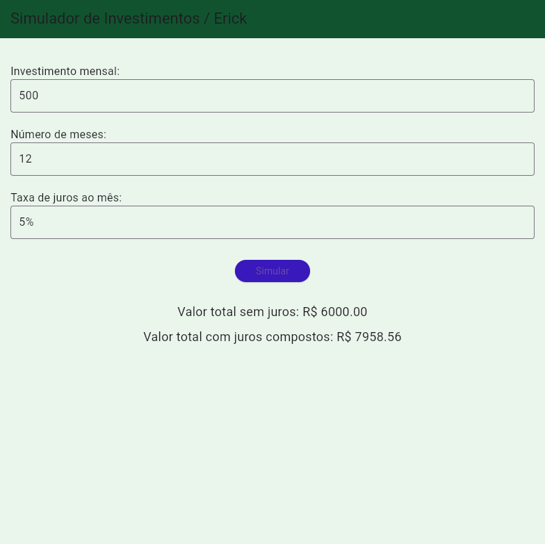

# app Calculo de Investimento 
Aplicativo de calculo de Investimentos

## Tecnologias
- Flutter
- Dart
- Firebase

## Como testar
- 1 Clonar o repositório
- 2 Abrir com Android Studio ou VsCode
- 3 Em um terminal, executar o comando:
```bash
flutter pub get
```
- 4 Executar o aplicativo em um emulador ou dispositivo físico ou em um navegador:
```bash
flutter run
```

## Prints 


## Repositórios 
https://github.com/ErickAguiar06/Bitola-flutter
https://github.com/ErickAguiar06/Financiamento-flutter
https://github.com/ErickAguiar06/AvaliacaoIMC
